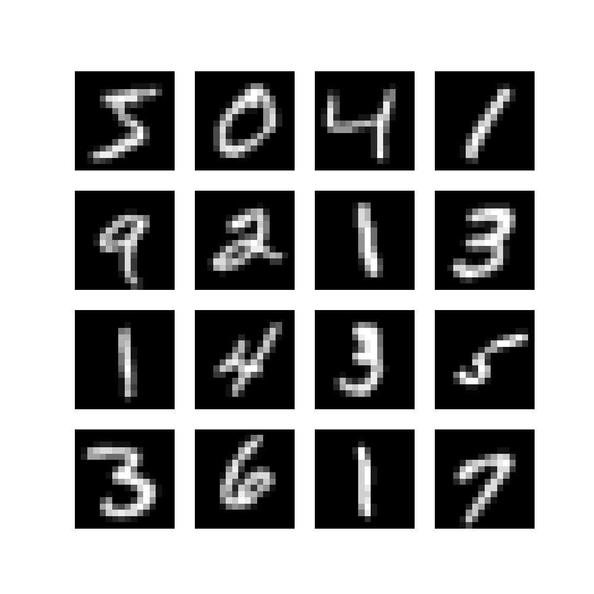
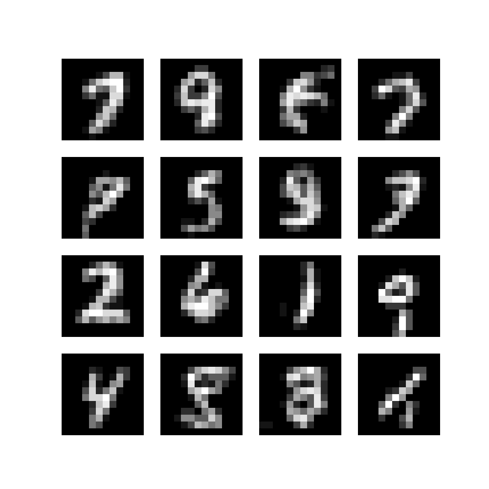
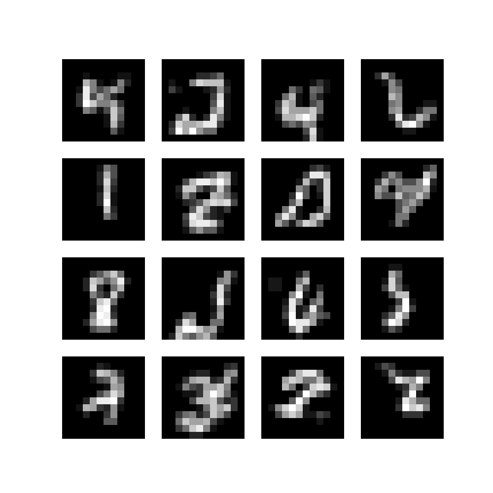
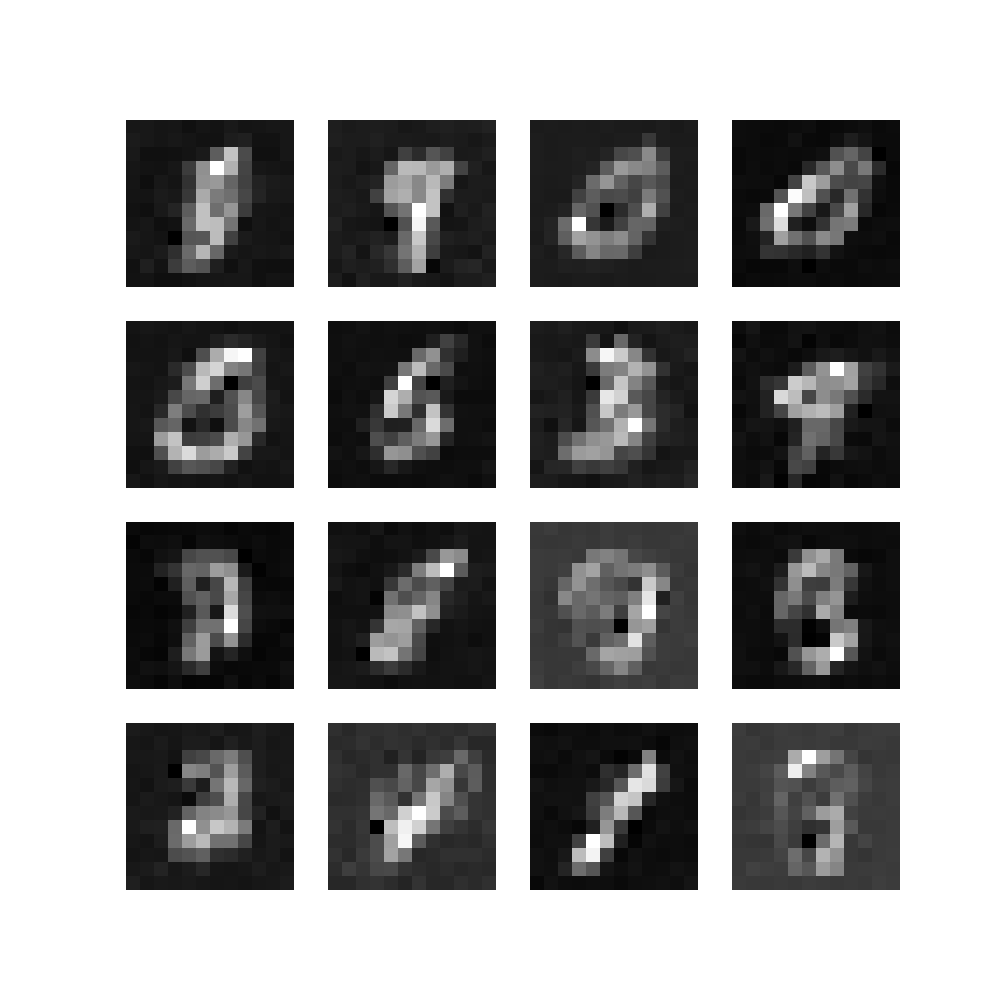
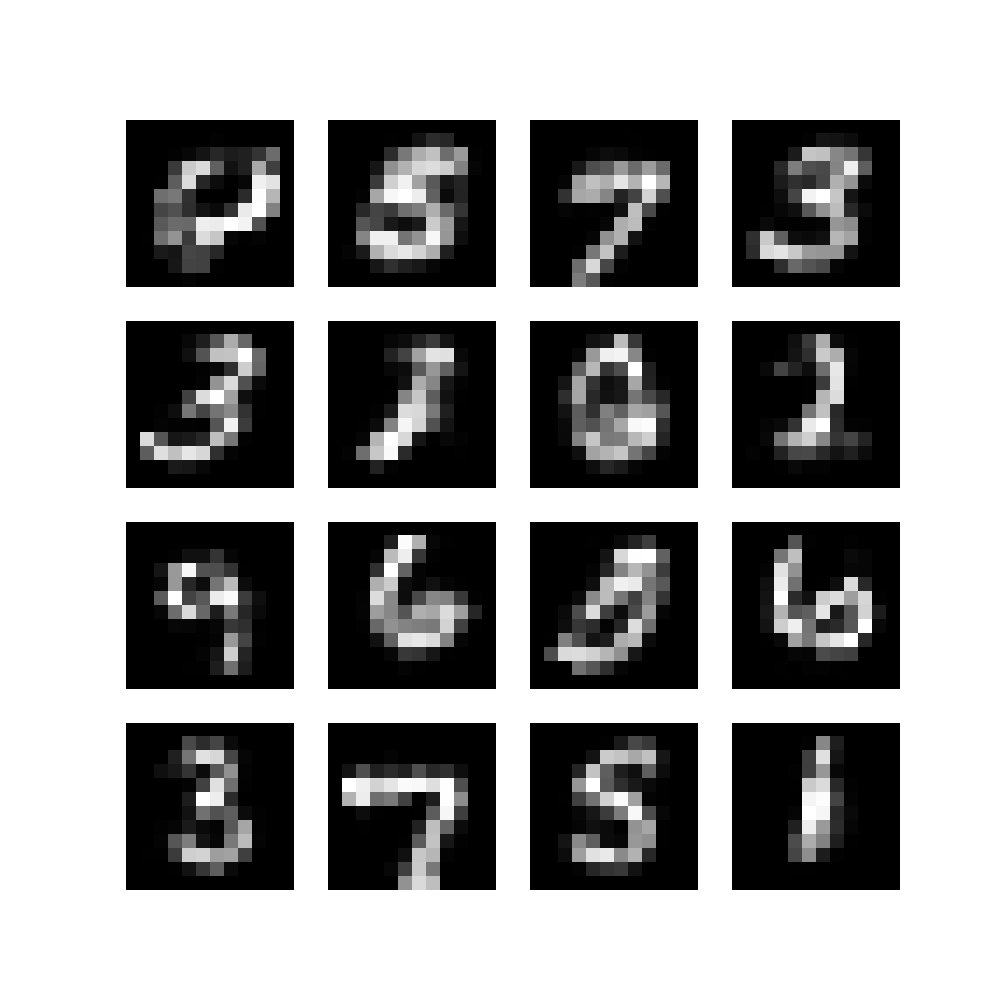
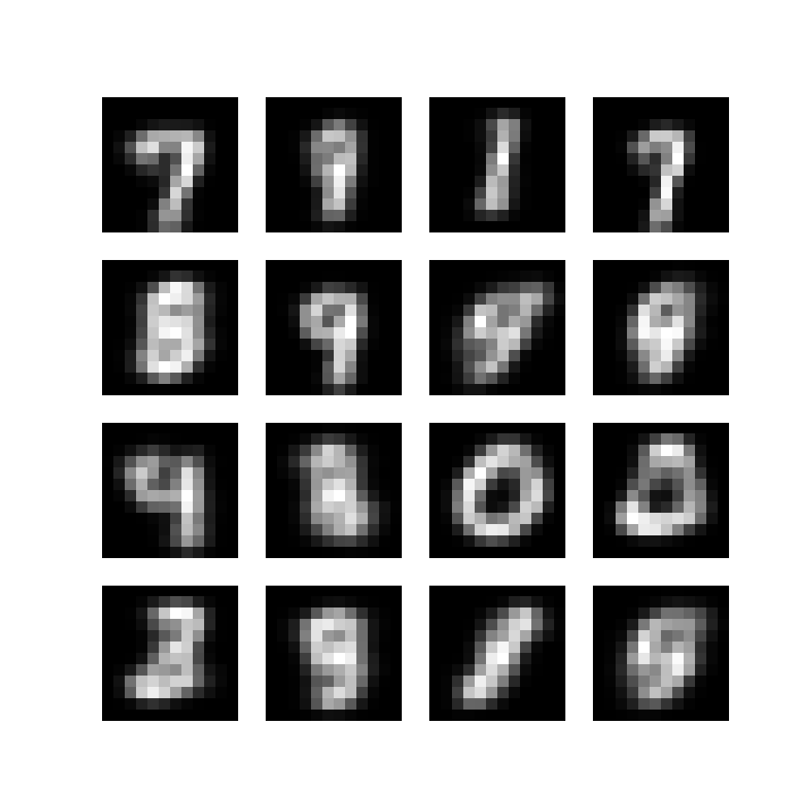
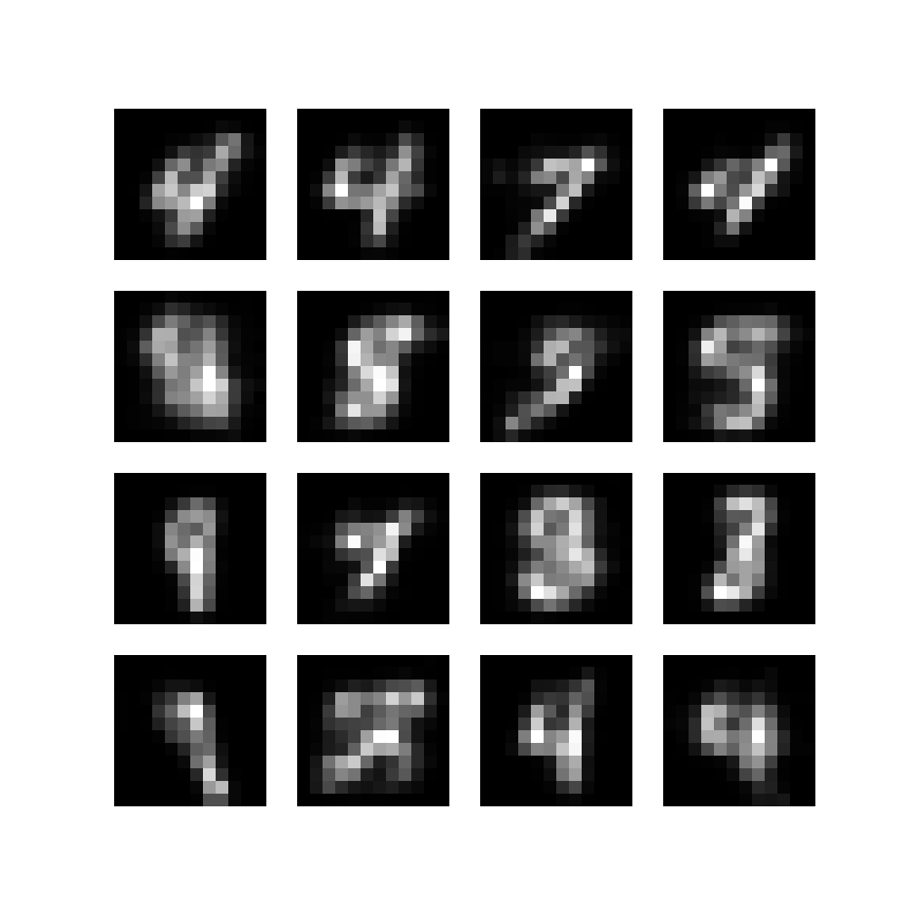
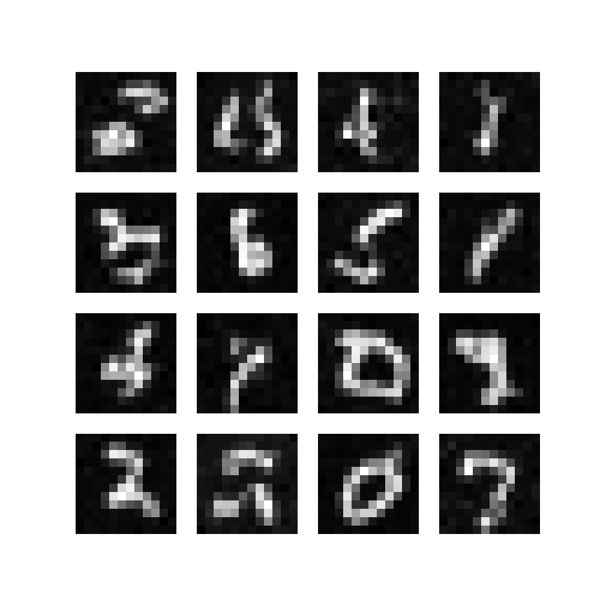

# Generative Models

This toy project is for the study of various generative models applied to small digit images. The goal of this project is to gain a better understanding of different generative model types.

## Dataset

For simplicity, this project focuses on small digit images (resized 12x12) from the MNIST dataset. Some models uses a flattened version of the digit images for linear layers or 1D domain applications.

## Instructions

Each generative model has its own directory. The main file for each model is located in its respective directory. You can select model types, as well as mode like train or inference, using arguments. Replace `[model]`, `[modes]`, and `[submodels]` with the appropriate values as described in each model section.

```bash
python . [model] [mode] --model [submodels]
```

Model files are saved in the `result` directory and default file name is `model`. You can change the file name for saving or loading models using the `--save_file` and `--load_file` arguments:

```bash
python . [model] [mode] --model [submodels] --save_file [file_name] --load_file [file_name]
```

## Models

The following generative models have been implemented considering various concepts such as autoregressive, flow-based, diffusion, etc. Each model is designed with either linear or convolutional layers to suit the application domain, whether it is one or two dimension representations.

### Autoregressive Model

Autoregressive models generate data sequentially by learning the probability distribution of each element based on the preceding elements.

- model: `arm`
- modes: `train` or `inference`
- submodels: `cnn1d`, `pixelcnn`

**Original**



**Dilated 1D Convolution Model Result**



**PixelCNN Model Result**




#### References
- [An Empirical Evaluation of Generic Convolutional and Recurrent Networks for Sequence Modeling](https://arxiv.org/pdf/1803.01271.pdf)
- [Predictive Sampling with Forecasting Autoregressive Models](http://proceedings.mlr.press/v119/wiggers20a/wiggers20a.pdf)
- [Wavenet: A Generative Model for Raw Audio](https://arxiv.org/pdf/1609.03499.pdf)
- [Pixel recurrent neural networks](https://arxiv.org/pdf/1601.06759v3.pdf)

### Flow-based Model
Flow-based models learn an invertible transformation between the data distribution and a simple prior distribution, enabling efficient sampling and density estimation.

- model: `flow`
- modes: `train` or `inference`
- submodels: `realnvp`

**Original**


**RealNVP Model Result**




#### References
- [Density Estimation using Real NVP](https://arxiv.org/pdf/1605.08803.pdf)
- [Learning Discrete Distributions by Dequantization](https://arxiv.org/pdf/2001.11235)

### Generative Adversarial Networks (GAN)

GANs consist of a generator and a discriminator that are trained together in a two-player adversarial game.

- model: `gan`
- modes: `train` or `inference`
- submodels: `lingan`

**Original**


**GAN Model with linear layers Result**




#### References
- [Generative Adversarial Networks](https://arxiv.org/abs/1406.2661)

### Variational Autoencoders (VAE)

VAEs are generative models that learn a probabilistic mapping between data and latent spaces by optimizing the ELBO, providing an efficient way to learn complex data distributions.

- model: `vae`
- modes: `train` or `inference`
- submodels: `mlp`

**Original**


**VAE with linear layers Result**




### Diffusion Models 

Diffusion models generate data using a series of Gaussian diffusion processes, with a forward diffusion process and a reverse denoising process to optimize the ELBO.

- model: `diffusion`
- modes: `train` or `inference`
- submodels: `naive-lin` or  `ddm-unet`

**Original**


**Naive Diffusion Model with linear layers Result**



**Deep Denoising Diffusion Model with U-Net Result**




#### References
- [Deep unsupervised learning using nonequilibrium thermodynamics](http://proceedings.mlr.press/v37/sohl-dickstein15.pdf)
- [Denoising Diffusion Probabilistic Models](https://proceedings.neurips.cc/paper/2020/file/4c5bcfec8584af0d967f1ab10179ca4b-Paper.pdf)
